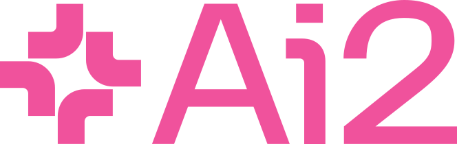

<!-- ═══ 1. HERO — split layout on dark band ═══ -->
<div class="e2s-bleed e2s-hero2" markdown>
<div class="e2s-hero2__inner" markdown>
<div class="e2s-hero2__text" markdown>

<h1>Earth2Studio<br><em>Unified platform for AI in Earth System Sciences</em></h1>

Run and verify AI-driven forecasts of the Earth system — on your own
infrastructure. **{{ n('models_total') }} open models** behind one Python API.

[Get started](#quickstart){ .md-button .md-button--primary }
[View on GitHub](https://github.com/NVIDIA/earth2studio){ .md-button }

<p class="e2s-pip"><code>uv add "earth2studio @ git+https://github.com/NVIDIA/earth2studio.git@0.17.0"</code></p>

<p class="e2s-badges">
<a href="https://pypi.org/project/earth2studio/"></a>
<a href="https://pypi.org/project/earth2studio/"></a>
<a href="https://github.com/NVIDIA/earth2studio/blob/main/LICENSE"></a>
</p>

</div>
<div class="e2s-hero2__img" markdown>

<div class="e2s-orbit" role="img" aria-label="Earth2Studio mark: weather icons orbiting Earth">

<div class="e2s-orbit__ring">
  <span class="e2s-orbit__icon" style="left:41.667%;top:3.333%"><svg viewBox="0 0 24 24" fill="none" stroke="#FFFFFF" stroke-width="1.5" stroke-linecap="round" stroke-linejoin="round"><circle cx="12" cy="12" r="4"></circle><path d="M12 2v3M12 19v3M2 12h3M19 12h3M4.9 4.9l2.1 2.1M17 17l2.1 2.1M19.1 4.9L17 7M7 17l-2.1 2.1"></path></svg></span>
  <span class="e2s-orbit__icon" style="left:74.667%;top:22.5%"><svg viewBox="0 0 24 24" fill="none" stroke="#FFFFFF" stroke-width="1.5" stroke-linecap="round" stroke-linejoin="round"><path d="M6 18h11a4 4 0 0 0 .6-7.95A6 6 0 0 0 6.3 8.6 4.5 4.5 0 0 0 6 18z"></path></svg></span>
  <span class="e2s-orbit__icon" style="left:74.667%;top:60.833%"><svg viewBox="0 0 24 24" fill="none" stroke="#FFFFFF" stroke-width="1.5" stroke-linecap="round" stroke-linejoin="round"><path d="M13 2L5 13h6l-1 9 8-11h-6z"></path></svg></span>
  <span class="e2s-orbit__icon" style="left:41.667%;top:80%"><svg viewBox="0 0 24 24" fill="none" stroke="#FFFFFF" stroke-width="1.5" stroke-linecap="round" stroke-linejoin="round"><path d="M2 9c2.5-3 4.5-3 7 0s4.5 3 7 0 4.5-3 6 0M2 16c2.5-3 4.5-3 7 0s4.5 3 7 0 4.5-3 6 0"></path></svg></span>
  <span class="e2s-orbit__icon" style="left:8.667%;top:60.833%"><svg viewBox="0 0 24 24" fill="none" stroke="#FFFFFF" stroke-width="1.5" stroke-linecap="round" stroke-linejoin="round"><path d="M12 13v8M9 21h6M12 13V5M12 13l6.9 4M12 13l-6.9 4"></path><circle cx="12" cy="13" r="1.4"></circle></svg></span>
  <span class="e2s-orbit__icon" style="left:8.667%;top:22.5%"><svg viewBox="0 0 24 24" fill="none" stroke="#FFFFFF" stroke-width="1.5" stroke-linecap="round" stroke-linejoin="round"><path d="M3 8h9a3 3 0 1 0-3-3M3 12h13a3 3 0 1 1-3 3M3 16h6a2 2 0 1 1-2 2"></path></svg></span>
</div>
</div>

</div>
</div>
</div>

<!-- ═══ 2. TRUST BAND ═══ -->
<div class="e2s-bleed e2s-trust">
  <span><a href="https://www.nvidia.com/en-us/high-performance-computing/earth-2/">Part of NVIDIA Earth-2</a></span>
  <span><a href="https://github.com/NVIDIA/earth2studio/blob/main/LICENSE">Apache-2.0 open source</a></span>
  <span><a href="user-guide/models/">{{ n('models_total') }} AI models</a></span>
  <span><a href="user-guide/data/">{{ n('data_sources') }} data sources</a></span>
</div>

<!-- ═══ 3. WHY IT MATTERS ═══ -->
## From anticipating extremes to exploring what's next { .e2s-centered #why-it-matters }

<p class="e2s-centered">AI Earth system models change the economics of
forecasting. When a global forecast takes seconds on a GPU instead of hours
on a supercomputer, ensembles grow from dozens of members to thousands — and
tail risks that were invisible become quantifiable.</p>

<p class="e2s-centered e2s-evidence">Peer-reviewed: km-scale downscaling at
least 22× faster and 1,300× more energy-efficient than CPU-based NWP
(<a href="https://www.nature.com/articles/s43247-025-02042-5"><em>Communications
Earth &amp; Environment</em>, 2025</a>) · a km-scale 12-hour forecast in
~2 minutes on a single GPU
(<a href="https://doi.org/10.1126/sciadv.adv0423"><em>Science Advances</em>,
2026</a>).</p>

<!-- ═══ 4. THE PLATFORM — four named pillars ═══ -->
<div class="e2s-bleed e2s-alt" markdown>

## The platform { .e2s-centered }

<p class="e2s-centered">Four interchangeable building blocks. Swap any of
them without rewriting the rest.</p>

<div class="grid cards e2s-cols-4" markdown>

- :fontawesome-solid-satellite: **AI-Ready Earth System Data Sources**

    ---

    Reanalysis, operational forecasts, and satellite and in-situ
    observations — analysis-ready and cloud-optimized, streamed on demand.

    [Explore data →](user-guide/data.md)

- :fontawesome-solid-brain: **Earth System Model Zoo**

    ---

    The largest open collection of prognostic and diagnostic Earth system
    AI models — from medium-range weather to subseasonal scales — with
    automatic checkpoint fetching.

    [Explore models →](user-guide/models.md)

- :fontawesome-solid-diagram-project: **Composable Inference Pipelines**

    ---

    Deterministic, ensemble, and downscaling workflows built from
    interchangeable blocks: models, data, perturbations, statistics, IO.

    [Explore workflows →](user-guide/workflows.md)

- :fontawesome-solid-circle-check: **Trusted Verification**

    ---

    GPU-accelerated deterministic and probabilistic metrics to score
    every forecast against analysis and real observations.

    [Explore verification →](user-guide/verification.md)

</div>

</div>

<!-- ═══ 5. QUICKSTART — tabbed code ═══ -->
## Your first forecast in five lines { .e2s-centered #quickstart }

<p class="e2s-centered">A data source, a model, a run function — checkpoints,
regridding, coordinates, and device placement are handled for you.</p>

<div class="e2s-quick" markdown>

=== "Deterministic"

    ```python
    from earth2studio.models.px import FCN3
    from earth2studio.data import GFS
    from earth2studio.io import ZarrBackend
    from earth2studio.run import deterministic

    model = FCN3.load_model(FCN3.load_default_package())
    deterministic(["2024-01-01"], 10, model, GFS(), ZarrBackend())
    ```

=== "Ensemble"

    ```python
    from earth2studio.models.px import SFNO
    from earth2studio.data import GFS
    from earth2studio.io import ZarrBackend
    from earth2studio.perturbation import SphericalGaussian
    from earth2studio.run import ensemble

    model = SFNO.load_model(SFNO.load_default_package())
    ensemble(["2024-01-01"], 10, 8, model, GFS(), ZarrBackend(), SphericalGaussian())
    ```

=== "Diagnostics"

    ```python
    from earth2studio.models.px import SFNO
    from earth2studio.models.dx import PrecipitationAFNO
    from earth2studio.data import GFS
    from earth2studio.io import ZarrBackend
    from earth2studio.run import diagnostic

    px = SFNO.load_model(SFNO.load_default_package())
    dx = PrecipitationAFNO.load_model(PrecipitationAFNO.load_default_package())
    diagnostic(["2024-01-01"], 10, px, dx, GFS(), ZarrBackend())
    ```

</div>

- :fontawesome-solid-check: Checkpoints fetch automatically
- :fontawesome-solid-check: Regridding and coordinates handled
- :fontawesome-solid-check: Swapping models is a one-line change

<div class="e2s-centered" markdown>

[Browse the example gallery :octicons-link-external-16:](https://nvidia.github.io/earth2studio/examples/){ .md-button .md-button--primary }
[Install guide :octicons-link-external-16:](https://nvidia.github.io/earth2studio/userguide/about/install.html){ .md-button }

</div>

<!-- ═══ 6. SPOTLIGHT ═══ -->
<div class="e2s-bleed e2s-alt" markdown>

<div class="e2s-spot" markdown>
<div class="e2s-spot__media" markdown>


</div>
<div class="e2s-spot__body" markdown>

### From experiment to operations

Chain data sources, models, perturbations, diagnostics, and statistics into
production pipelines — then swap any piece without rewriting the rest.
Graduate from a notebook to recipes like huge ensembles and S2S forecasting.

[Explore workflows →](user-guide/workflows.md)

</div>
</div>

</div>

<!-- ═══ 7. INSTITUTIONS + MODEL TEASER ═══ -->
## Models from leading institutions { .e2s-centered }

<p class="e2s-centered">The Earth2Studio model zoo includes Earth system AI
models developed by research teams across industry and academia — the same
model families powering national forecasting and digital-twin initiatives.</p>

<div class="e2s-logos">
  
  
  
  
  
  
  
  <span>Shanghai AI Lab</span>
</div>

<p class="e2s-centered e2s-evidence">Model architectures in the zoo originate
from these research teams. Logos do not imply endorsement.</p>

<div class="e2s-centered" markdown>
[Browse the full model zoo :octicons-arrow-right-24:](user-guide/models.md){ .md-button }
</div>

<!-- ═══ 8. ECOSYSTEM ═══ -->
<div class="e2s-bleed e2s-alt" markdown>

## Built open, connected everywhere { .e2s-centered }

<div class="grid cards" markdown>

- :fontawesome-solid-cubes: **Train with PhysicsNeMo**

    ---

    PhysicsNeMo trains physics-AI models; Earth2Studio deploys them.
    NVIDIA's open Earth-2 models flow directly into the zoo.

    [PhysicsNeMo →](https://docs.nvidia.com/physicsnemo/latest/index.html)

- :fontawesome-solid-layer-group: **Speaks the scientific stack**

    ---

    Outputs stream to Zarr and NetCDF, landing directly in the
    xarray / Pangeo analysis ecosystem — no conversion steps.

    [Ecosystem →](user-guide/ecosystem.md)

- :fontawesome-solid-robot: **Agent-ready**

    ---

    Official skills let coding agents install Earth2Studio, pick a model,
    fetch data, and run a first forecast automatically.

    [NVIDIA Skills →](https://build.nvidia.com/skills?q=earth2studio)

</div>

</div>

<!-- ═══ 9. WHO IT'S FOR ═══ -->
## Who it's for { .e2s-centered }

<div class="grid cards e2s-cols-fit" markdown>

- :fontawesome-solid-microscope: **Scientists & researchers**

    ---

    Benchmark models on identical data through one API; verify with built-in metrics.

- :fontawesome-solid-satellite-dish: **Met services & agencies**

    ---

    Run, fine-tune, and deploy forecasting capability on infrastructure you control.

- :fontawesome-solid-building: **Enterprises**

    ---

    Ensembles for risk quantification in energy, insurance, logistics, and agriculture.

- :fontawesome-solid-code: **Developers**

    ---

    Weather-aware products on a composable Python SDK, with agent-ready skills.

- :fontawesome-solid-graduation-cap: **Educators & students**

    ---

    A free, open on-ramp to Earth system AI that runs on a single GPU.

</div>

<!-- ═══ CLOSING CTA ═══ -->
<div class="e2s-centered" markdown>

## Ready to run your first forecast?

*Our mission is to enable everyone to build, research, and explore AI-driven
weather and climate science.*

[Get started](#quickstart){ .md-button .md-button--primary }
[Browse examples :octicons-link-external-16:](https://nvidia.github.io/earth2studio/examples/){ .md-button }

</div>

??? note "Cite Earth2Studio"

    
    ```bibtex
    @software{earth2studio2024,
      author  = {{Earth2Studio Contributors}},
      title   = {{NVIDIA Earth2Studio}},
      url     = {https://github.com/NVIDIA/earth2studio},
      year    = {2024}
    }
    ```
    
